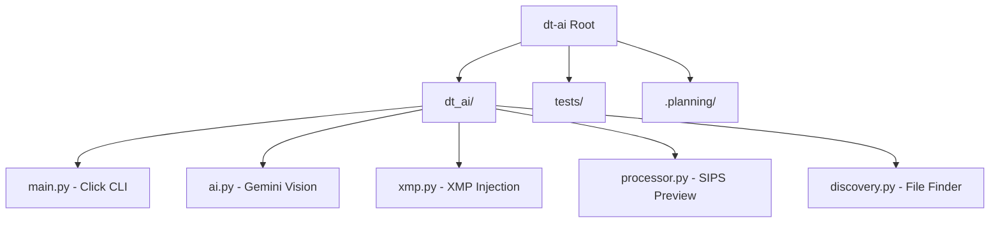

# AGENTS.md - Darktable GenAI Assistant (dt-ai)

This file provides a starting point for AI assistants to navigate the `dt-ai` codebase. For detailed documentation, see [.agents/summary/index.md](.agents/summary/index.md).

## Directory Overview & Component Map

### Core Subsystems
- **CLI (`dt_ai/main.py`):** Orchestrates the `audit` and `edit` pipelines.
- **Intelligence (`dt_ai/ai.py`):** Manages vision prompts and structured response parsing.
- **Sidecar Engine (`dt_ai/xmp.py`):** Handles XML manipulation and IEEE 754 hex encoding for Darktable.
- **Image Extraction (`dt_ai/processor.py`):** Interface for macOS `sips`.

## Repo-Specific Tools
- **`uv`:** Used for environment management (`uv run dt-ai ...`).
- **`sips`:** macOS native tool used for preview extraction.
- **`darktable`:** Required to be installed on the system for XMP consumption and GUI handoff.

## Key Patterns
- **Non-Destructive Editing:** Original RAW files are never touched. All edits go to `.xmp` sidecars.
- **Version Numbering:** The system automatically increments XMP version numbers (e.g., `image_01.arw.xmp`).
- **Binary Encoding:** Darktable parameters are hex-encoded strings of little-endian floats. Use `dt_ai.xmp.encode_params`.

## Configuration & Standards
- **Linter:** Standard Python/Click conventions.
- **Tests:** Run with `pytest`. Located in `tests/`.
- **State:** Hidden `.dt-ai-state.json` file in the target directory manages session progress.

## Custom Instructions

<!-- This section is maintained by developers and agents during day-to-day work.
     It is NOT auto-generated by codebase-summary and MUST be preserved during refreshes.
     Add project-specific conventions, gotchas, and workflow requirements here. -->
