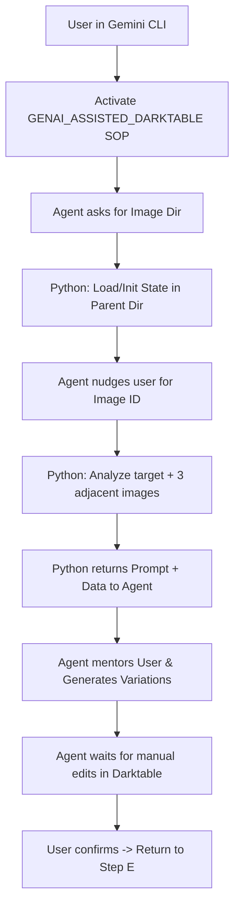

# Detailed Design: Darktable Agentic Workflow Overhaul

## Overview
This design transforms the standalone `dt-ai` CLI into an agentic "Prompt Provider" system. The workflow is orchestrated by a dedicated Agent SOP (`GENAI_ASSISTED_DARKTABLE.sop.md`), which uses Python to maintain state and generate educational, talkative guidance for the user.

## Detailed Requirements

### Core Functional Requirements
- **Project Discovery**: Agent asks for the image directory upfront and checks for a `.progress.json` in the parent folder.
- **User-Led Processing**: User specifies which RAW image to "tinker with."
- **Context-Aware Nudging**: Python looks at 2-3 adjacent images to provide smarter, talkative recommendations.
- **Persistence**: Session state is saved in `<parent>/.dt-ai-progress.json`.
- **Interactive Wait**: Agent pauses after generating variations to allow for manual user edits in Darktable.
- **Tone**: Talkative, educational, and mentorship-oriented.

### Technical Constraints
- **Platform**: macOS.
- **SOP**: Must follow Strands CLI best practices for Agent SOPs.
- **Persistence**: Project-local JSON for portability.
- **Language**: Python 3.12 (Refactored from v1).

## Architecture Overview



## Components and Interfaces

### 1. Agent SOP (`GENAI_ASSISTED_DARKTABLE.sop.md`)
- **Parameters**: `image_dir` (required).
- **Instruction Set**: High-level guidance for opening Darktable, importing, and the interaction loop.
- **Constraints**: "One question at a time," "Educational tone," "Always call Python for next-step logic."

### 2. Python State Manager (`state.py`)
- **Schema**: `.dt-ai-progress.json`
  - `project_root`: Path to RAW files.
  - `processed_files`: List of images handled.
  - `session_started`: ISO Timestamp.
- **Interface**: `load_state(dir)`, `save_state(state)`, `update_progress(image_id)`.

### 3. Prompt Provider API (`main.py` refactor)
- **New Command**: `agent-next <image_id>`.
- **Logic**:
  1. Extract preview for target and neighbors.
  2. Call Gemini Vision for target analysis.
  3. Synthesize "Talkative Mentor" response.
  4. Return JSON: `{ "message": "...", "can_proceed": bool, "data": {...} }`.

## Data Models

### Progress State Schema
```json
{
  "project_path": "/Users/.../Pictures/MyShoot",
  "history": [
    {"image": "IMG_1234.ARW", "styles": ["natural", "moody"], "timestamp": "..."}
  ],
  "last_processed": "IMG_1234.ARW"
}
```

## Workflow Integration
- **Handoff**: Use `click.pause` or simple `input()` in the Python backend to keep the session alive, or rely on the Agent's natural conversational pause.
- **UI Interaction**: Use `open -a darktable` to focus the app for the user at the start of each image cycle.

## Testing Strategy
- **SOP Validation**: Manual walkthrough of the SOP in a clean session.
- **State Integrity**: Verify `.dt-ai-progress.json` is created and correctly updated.
- **Adjacent Image Logic**: Unit test the discovery logic for "Neighboring" files (alphabetical sort order).

## Appendices
- **Persona Guidelines**: The Agent should explain terms like "dynamic range" or "eye-tracking focus" during the nudge phase.
