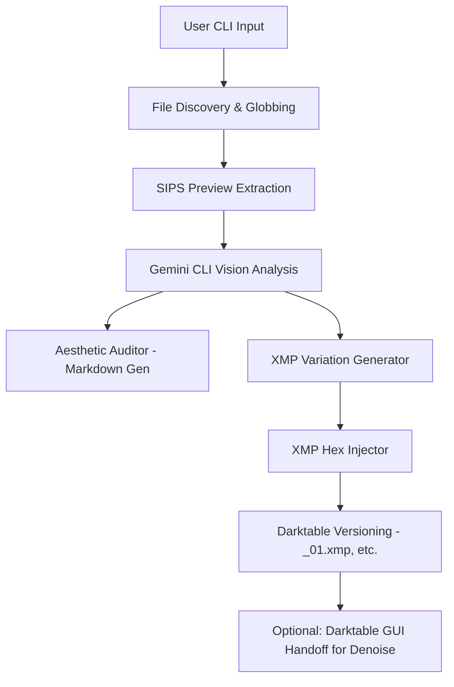

# Detailed Design: Darktable GenAI Assistant

## Overview
A macOS CLI application (`dt-ai`) that provides a GenAI-driven "first pass" for RAW photo editing in Darktable. The tool analyzes image previews via Gemini CLI, generates aesthetic audits, and automates the creation of Darktable version duplicates with varying edit styles.

## Detailed Requirements

### Core Functional Requirements
- **Targeting**: Process single RAW files or groups via glob patterns (e.g., `*.ARW`).
- **Preview Extraction**: Generate 2048px JPEG previews using macOS `sips`.
- **Aesthetic Audit**: Produce a Markdown sidecar report (e.g., `IMG_1234_audit.md`) with commentary on composition, focus, and lighting.
- **Variations**: Create 3 distinct sidecar duplicates (Natural, Dramatic, Creative) using Darktable's `_nn.xmp` naming convention.
- **Automated Editing**: Inject hex-encoded parameters for Exposure, Temperature, and Color Balance into XMP files.
- **Interactive Denoise**: Handle complex denoising by opening Darktable GUI for user-validated "best guess" edits.

### Technical Constraints
- **Platform**: macOS (requires `sips`, `darktable`, and `gemini-cli`).
- **Language**: Python 3.12+ (managed by `uv`).
- **Non-Destructive**: Never modify original RAW files; only read/write `.xmp` and `.md` files.

## Architecture Overview



## Components and Interfaces

### 1. CLI Entry Point (`main.py`)
- Commands: `audit` (dry-run), `edit` (apply XMPs).
- Library: `click`.

### 2. Image Processor (`processor.py`)
- Interface: `extract_preview(path) -> preview_path`.
- Tool: `sips`.

### 3. AI Orchestrator (`ai.py`)
- Interface: `analyze_image(preview_path) -> AIResultJSON`.
- Prompting: System instructions optimized for Darktable module names and hex-param logic.

### 4. XMP Engine (`xmp.py`)
- Interface: `create_version(base_xmp, version_num, parameters) -> version_xmp_path`.
- Logic: XML parsing (ElementTree) and hex-encoding for module params.

## Data Models

### AI Result Schema
```json
{
  "audit": "...",
  "recommendations": ["module1", "module2"],
  "variations": {
    "natural": { "exposure": 0.5, "temp": 5500 },
    "dramatic": { "exposure": 1.2, "temp": 6500 },
    "creative": { "exposure": -0.5, "temp": 4500 }
  }
}
```

## Error Handling
- **Missing Tools**: Verify `sips` and `darktable` are in PATH at startup.
- **API Failure**: Graceful exit if Gemini CLI fails, preserving extracted previews for retry.
- **XMP Conflict**: Use the "Branching" strategy to avoid overwriting Version 0 edits.

## Testing Strategy
- **Unit Tests**: XMP XML parsing and hex-parameter encoding.
- **Integration Tests**: End-to-end flow from RAW input to XMP output (mocking Gemini CLI).
- **Manual Verification**: Opening generated `.xmp` files in Darktable to verify slider positions.

## Appendices
- **Technology Choices**: Python/Click chosen for ease of system integration.
- **Research Findings**: Confirmed `_01.xmp` naming and `sips` efficacy.
- **Denoise Strategy**: Deferred to interactive GUI handoff due to camera-profile complexity in hex strings.

## Workflow Integration (Least Intrusive)
- **Zero Database Interaction**: The tool interacts exclusively with the filesystem (`.xmp` and `.md` files). This ensures no conflicts with an active Darktable session and its database lock.
- **Background Previewing**: By using `sips` for preview extraction, the tool can analyze images in parallel while the user is actively working in Darktable.
- **User-Triggered Refresh**: Since Darktable does not always auto-detect new sidecars at runtime, the CLI will guide the user to the "Read from sidecar" action in the Lighttable view to sync the AI variations.
- **GUI Handoff**: The interactive Denoise step uses the macOS `open` command to focus the existing Darktable instance on the target image, respecting the single-instance nature of the app.

## Real-World Verification
- **Verification Environment**: Testing will leverage real photo directories in `~/Pictures` (e.g., `nagarhole mar 2026`).
- **Integration Tests**: Will verify that the tool correctly identifies existing `.xmp` files in these directories and applies branching logic as designed.
- **Visual Validation**: Generated `_01.xmp` files will be verified by opening the real folders in Darktable.
