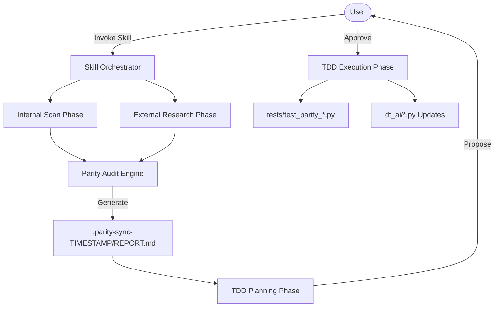

# Detailed Design: darktable-parity-sync Skill

## Overview
The `darktable-parity-sync` skill is an agentic tool designed to keep the `dt-ai` codebase aligned with the latest advancements in Darktable. It autonomously researches industry trends, audits the existing implementation, and proposes TDD-driven updates to prompts, business logic, and XMP schemas.

## Detailed Requirements
- **Full Codebase Scan:** Inspired by `codebase-summary`, the skill must analyze all relevant modules (`dt_ai/*.py`) to understand current capabilities.
- **External Parity Research:** Leverage web search, Darktable blogs, and GitHub to identify new modules (e.g., AgX), schema changes, and workflow shifts.
- **Hybrid Interaction:** Propose changes to the user for approval rather than applying them silently.
- **Auditing:** Generate a structured Parity Report using standard auditing patterns.
- **TDD Implementation:** Drive code updates through a red-green-refactor cycle, drawing inspiration from `code-assist`.
- **Progress Tracking:** Use a hidden, time-stamped directory (e.g., `.parity-sync-20260501-120000/`) for all temporary artifacts.
- **Documentation:** Automatically update `README.md` with invocation instructions for major CLIs (Claude, Gemini, Kiro).

## Architecture Overview
The skill operates as a high-level orchestrator using a three-phase pipeline: **Audit**, **Plan**, and **Execute**.

## Components and Interfaces

### 1. Parity Audit Engine
- **Input:** Internal codebase map + External research findings.
- **Output:** A standardized audit report identifying "Gaps", "Deprecations", and "New Opportunities".
- **Patterns:** Uses Gap Analysis (Current vs. Target).

### 2. TDD Orchestrator
- **Responsibility:** For each approved update, it writes a failing test case, implements the fix, and validates it.
- **Motivation:** `code-assist` workflow logic.

### 3. Schema Mapper
- **Responsibility:** Specifically monitors `dt_ai/xmp.py` to ensure IEEE 754 encoding and module versions match the target Darktable version.

## Data Models

### Parity Report Structure (`REPORT.md`)
1.  **Summary:** High-level status.
2.  **Module Gaps:** Discrepancies in `dt_ai` logic.
3.  **Prompt Gaps:** Missing context in `ai.py` (e.g., AgX vs. Filmic).
4.  **Schema Gaps:** Outdated module versions or parameter structs.
5.  **Proposed Remediation:** Step-by-step TDD implementation plan.

### Progress Directory Layout
- `.parity-sync-{TIMESTAMP}/`
    - `research/`: Raw search results.
    - `REPORT.md`: The finalized audit.
    - `plan.md`: The TDD task list.
    - `logs/`: Build and test outputs.

## Testing Strategy
- **Self-Testing:** The skill must generate its own parity tests (prefixed with `test_parity_`) to verify that updates actually meet the new schema requirements.
- **Regression:** Existing tests must be run after parity updates to ensure no breakage.

## Appendices

### Technology Choices
- **Search:** `google_web_search` + `web_fetch`.
- **Orchestration:** PDD and Code-Assist methodology.

### Research Findings Summary
- Darktable 5.4+ introduces "Workspaces" and "AgX".
- "Levels" and "Contrast" are deprecated; "Color Balance RGB" is the modern standard.
- Homebrew formula is moving to a custom tap.
