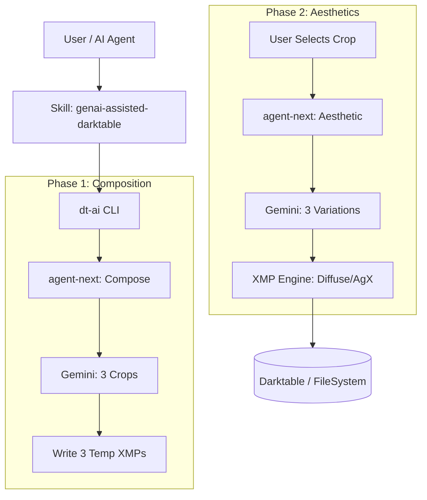

# Detailed Design: Darktable GenAI Assistant Enhancements

## Overview
This design document details the implementation of intelligent cropping, advanced detail management (`diffuse or sharpen`), and expert mentorship for the `dt-ai` tool. It also addresses maintaining parity with the latest Darktable standards.

## Detailed Requirements

### 1. Intelligent Cropping (CROP)
- **CROP-01**: `dt-ai agent-next` shall output a JSON payload containing 3 crop suggestions. Each suggestion includes normalized coordinates (`cx`, `cy`, `cw`, `ch`), a `rotation` angle (leveling or creative tilt), and a text rationale.
- **CROP-02**: The `genai-assisted-darktable` skill shall implement a "Selection Step":
  - Generate 3 temporary XMP sidecars (`_crop1.xmp`, etc.).
  - Pause for user review in Darktable Lighttable.
  - Accept a numerical selection (1, 2, or 3) from the user.
  - Clean up extra temporary files after selection.
- **CROP-03**: `xmp.py` shall implement the `clipping` (v5) and `ashift` (v5) modules to apply the selected composition.

### 2. Advanced Detail & Noise (MOD)
- **MOD-01**: `xmp.py` shall implement the `diffuse or sharpen` module with binary C-struct packing (68 bytes). It must support multiple instances (e.g., "denoise" and "deblur").
- **MOD-02**: The system shall automatically apply `lens` correction and `cacorrect` (Chromatic Aberration) to all edits.
- **MOD-03**: The pipeline sequence must strictly follow the expert order: `lens` -> `denoiseprofile` -> `demosaic` (Capture Sharpening) -> `exposure` -> `diffuse`.

### 3. Knowledge Base & Mentorship (KB)
- **KB-01**: Expert rules (e.g., "denoise before sharpen", high-ISO chroma prioritization) shall be encoded in a separate research database module.
- **KB-02**: The `SKILL.md` SOP shall include a search step for professional tutorials, with findings integrated into the "Mentor Report."

### 4. Parity Sync (SYNC)
- **SYNC-01**: The `darktable-parity-sync` skill shall be updated to include the 2026 binary struct layouts and expert sequencing rules in its audit logic.

## Architecture Overview



## Components and Interfaces

### `dt_ai/xmp.py` (Enhancements)
- `get_clipping_params(cx, cy, cw, ch)`: Generates 84-byte hex string.
- `get_ashift_params(rotation, guide)`: Generates 48-byte hex string.
- `get_diffuse_params(iterations, radius, speed, anisotropy)`: Generates 68-byte hex string.
- `add_diffuse_instance(root, mode)`: Adds a named instance (e.g., "Surgical Sharpen").

### `dt_ai/ai.py` (Enhancements)
- `get_composition_prompt()`: New prompt for Stage 1.
- `get_aesthetic_prompt(crop_rationale)`: Updated prompt for Stage 2.

### `skills/genai-assisted-darktable/SKILL.md` (Enhancements)
- New step for tutorial search.
- New step for crop selection loop.

## Data Models

### Crop Suggestion JSON
```json
{
  "options": [
    {
      "id": 1,
      "description": "Rule of Thirds - Horizon focused",
      "rationale": "Leveling the horizon makes the bird feel grounded.",
      "params": {"cx": 0.1, "cy": 0.2, "cw": 0.8, "ch": 0.6, "rotation": -1.2}
    }
  ]
}
```

## Testing Strategy
- **Unit Tests**: Verify `struct.pack` outputs against known valid Darktable hex strings for all new modules.
- **Integration Tests**: Verify that `_crop1.xmp` is correctly generated and readable by Darktable.
- **E2E Tests**: Mock Gemini responses for both Stage 1 and Stage 2 and verify the final XMP history stack order.

## Appendices
- **Binary Structs**: See `research/technical-modules.md`.
- **Expert Workflows**: See `research/wildlife-workflows.md`.
