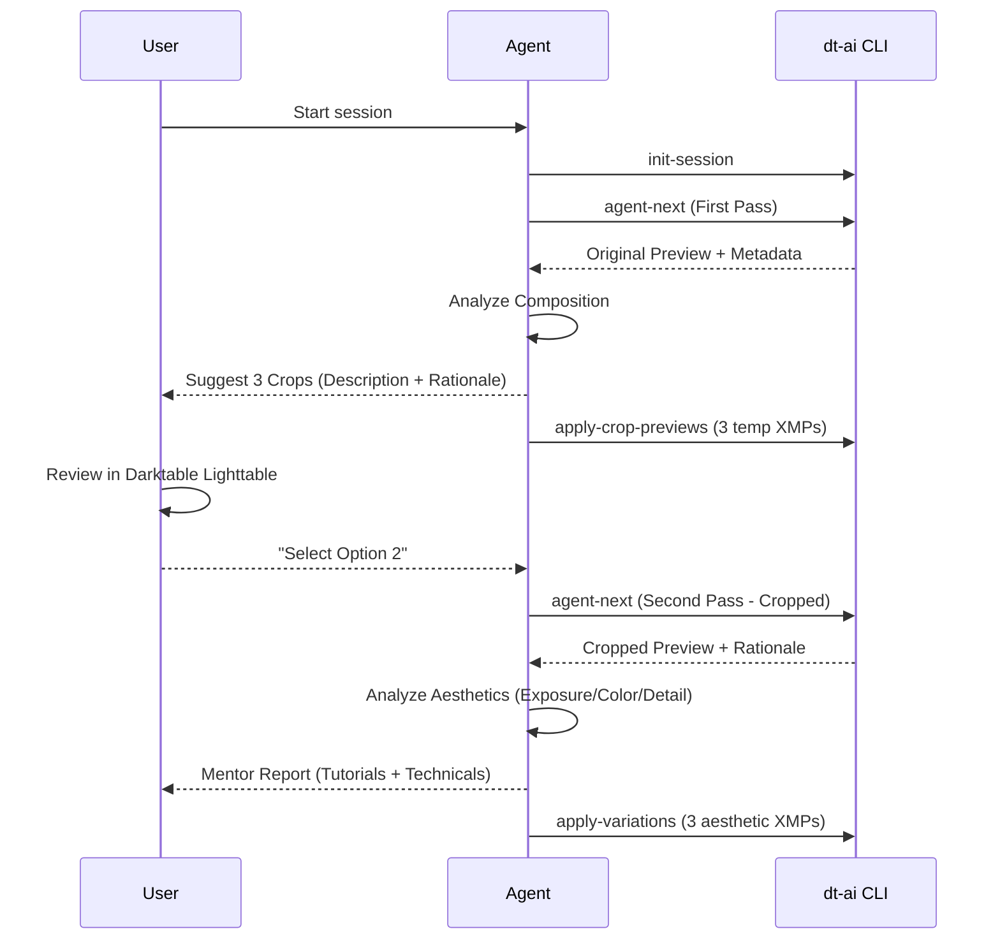

# Composition Logic: Two-Stage Cropping & Rotation

This document outlines the logic for the intelligent cropping enhancement and the user selection flow.

## 1. Two-Stage Workflow

To ensure high-quality results, the `dt-ai` workflow will be split into two discrete creative phases.

## 2. Coordinate Mapping
- **Normalized Scale**: Darktable uses a **0.0 to 1.0** coordinate system for its `clipping` module.
- **Orientation Awareness**: The AI must account for the `orientation` module (EXIF rotation) when calculating crop coordinates to avoid "flipped" crops.
- **Rotation (Leveling)**:
    - **Technical**: Small adjustments (±0.1° to ±2.0°) for leveling horizons.
    - **Creative**: Aggressive tilts (±5.0° to ±15.0°) for dynamic wildlife shots.
    - **Implementation**: Rotation values are stored in the `ashift` module's `rotation` field (float).

## 3. Temporary Preview Pattern
1. **Creation**: When the AI suggests 3 crops, it calls `apply-variations` with a special `mode="crop-preview"`.
2. **Naming**: The files are named `<image>_crop1.xmp`, `<image>_crop2.xmp`, etc.
3. **Selection**: Once the user chooses a crop (e.g., "1"), the AI promotes `crop1.xmp` to the "base" for aesthetic variations.
4. **Cleanup**: All other `_crop*.xmp` files are deleted.
