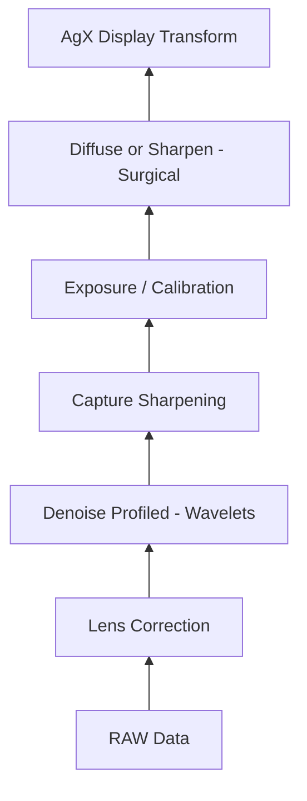

# Expert Wildlife Photography Workflows (2026)

This document encodes professional best practices for the AI's technical reasoning engine.

## 1. Pipeline Sequencing (Bottom-to-Top)
The order of modules in Darktable's pixelpipe is critical. For the `dt-ai` engine, we must ensure high-quality signals before sharpening.

## 2. Advanced Detail Rules

### Denoising (The "Clean First" Rule)
- **High ISO (>1600)**: Prioritize **Chroma Denoise** (higher strength) over Luma. Preserve feather/fur texture.
- **Wavelets**: Use wavelet-based denoising for a more natural look than non-local means.

### Sharpening (The "Layered" Approach)
1. **Baseline**: Use the new **Capture Sharpening** module for every image. (8-10 iterations, small radius).
2. **Surgical**: Use **Diffuse or Sharpen** only for subjects.
    - *Motion Blur*: Use "Lens Deblur" preset (20-40 iterations).
    - *Atmospheric Haze*: Use "Local Contrast" preset.
3. **Multiple Instances**: It is professional practice to stack instances.
    - *Instance 1*: Global denoise.
    - *Instance 2*: Subject deblur (with drawn mask).

## 3. Aesthetic Decision Matrix

| Subject | Lighting | Strategy |
|---|---|---|
| Wildlife (Birds) | Harsh Sun | **AgX** Tone Mapper + Strong Chroma Denoise. |
| Wildlife (Mammals) | Overcast | **Sigmoid** Tone Mapper + "Local Contrast" for fur bite. |
| Landscape | Sunset | **AgX** Tone Mapper + "Deblur: Hard" for distant details. |

## 4. Subject-Specific "Mentor" Rationale
- **Birds**: Focus on the eyes. Use sharpening to recover micro-detail in the iris.
- **Action**: Look for motion blur. Suggest "Diffuse or Sharpen: Deblur" to stabilize edges.
- **Composition**: Suggest "Cinematic" crops for animals moving across the frame (Lead Room).
