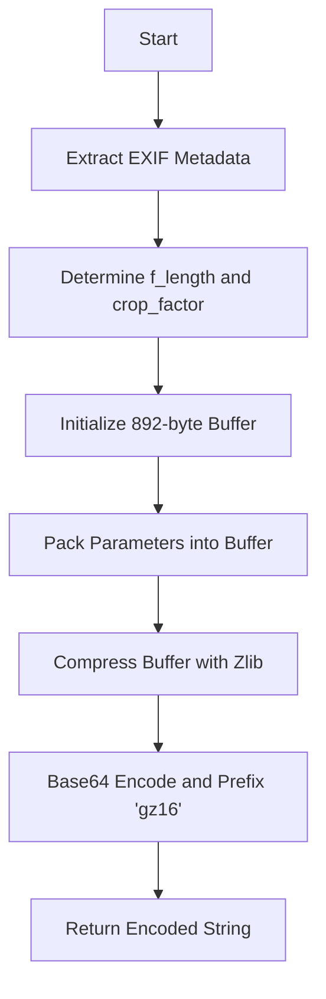

# Detailed Design: Re-enabling Rotation (Ashift v5)

## Overview
This document outlines the design for fixing the `ashift` v5 rotation functionality in the agentic workflow. The current implementation uses a 48-byte structure which is incompatible with Darktable 2026, leading to "insane data" errors. This design specifies the correct 892-byte structure, Zlib compression, and integration with image metadata.

## Detailed Requirements
*   **Binary Compatibility:** Implement the 892-byte `dt_iop_ashift_params_t` structure as used in Darktable v5.x.
*   **Parameter Support:**
    *   `rotation`: Floating-point degrees.
    *   `f_length`: Focal length (extracted from EXIF or overridden).
    *   `crop_factor`: Camera sensor crop factor (extracted from EXIF or overridden).
*   **Automatic Fitting:** Configure the module to use the "Largest Area" crop mode (`cropmode = 1`) by default.
*   **Compression:** Encode the binary structure using Zlib (deflate) and Base64, prefixed with `gz16`.

## Architecture Overview
The fix will be implemented within the `dt_ai/xmp.py` module, specifically updating the `get_ashift_params` function. The workflow for generating `ashift` parameters will follow this flow:

## Data Models

### `dt_iop_ashift_params_t` (892 bytes)

| Offset | Field | Type | Description | Default |
| :--- | :--- | :--- | :--- | :--- |
| 0 | `rotation` | float | Rotation in degrees | 0.0 |
| 4 | `lensshift_v` | float | Vertical lens shift | 0.0 |
| 8 | `lensshift_h` | float | Horizontal lens shift | 0.0 |
| 12 | `shear` | float | Shear transformation | 0.0 |
| 16 | `f_length` | float | Focal length (mm) | 28.0 |
| 20 | `crop_factor` | float | Sensor crop factor | 1.0 |
| 24 | `orthocorr` | float | Lens dependence | 100.0 |
| 28 | `aspect` | float | Aspect ratio adjustment | 1.0 |
| 32 | `mode` | int32 | Lens model (0: Generic) | 0 |
| 36 | `cropmode` | int32 | Fitting mode (1: Largest Area) | 1 |
| 40 | `cl` | float | Left crop boundary | 0.0 |
| 44 | `cr` | float | Right crop boundary | 1.0 |
| 48 | `ct` | float | Top crop boundary | 0.0 |
| 52 | `cb` | float | Bottom crop boundary | 1.0 |
| 56 | `last_drawn_lines` | float[200] | Detected/Drawn lines | [0.0...0.0] |
| 856 | `last_drawn_lines_count` | int32 | Count of lines | 0 |
| 860 | `last_quad_lines` | float[8] | Quad correction lines | [0.0...0.0] |

## Components and Interfaces

### `dt_ai/xmp.py`

#### `get_ashift_params(rotation: float, focal_length: float = 28.0, crop_factor: float = 1.0) -> str`
*   **Responsibility:** Generates the compressed and encoded `ashift` v5 parameter string.
*   **Implementation Detail:**
    *   Create a zeroed-out 892-byte bytearray.
    *   Use `struct.pack_into` with format `<8f2i4f` for the first 56 bytes.
    *   Apply `zlib.compress` to the full 892 bytes.
    *   Prepend `gz16` and Base64 encode the result.

## Testing Strategy
*   **Unit Test:** Create a test case in `tests/test_xmp_structs.py` that verifies the generated hex matches the reverse-engineered string for known parameters (e.g., 1.76 rotation, 600mm focal length, 3.386 crop factor).
*   **Compression Test:** Verify that `zlib.decompress` on the generated string (after stripping `gz16` and B64 decoding) yields the expected 892-byte buffer.
*   **Integration Test:** Verify that the `ashift` module is correctly added to the XMP history stack in `tests/test_xmp_history.py`.

## Appendices

### Technology Choices
*   **Zlib:** Standard compression used by Darktable for large XMP parameter blocks.
*   **Struct Packing:** Python's `struct` module is used for precise binary mapping of C-structures.

### Research Findings
*   Confirmed the 892-byte size through binary decompression of a working XMP sample.
*   Identified the `gz16` prefix as the version marker for `ashift` v5.
*   Mapped fields based on Darktable 5.4 source code analysis.
