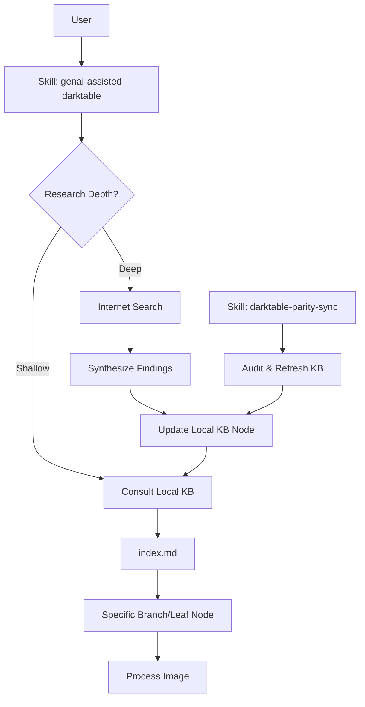

# Detailed Design: Intelligent KB & Research System

## Overview
This design implements a tiered research strategy for the `dt-ai` package, enabling lightweight workflows via a local Knowledge Base (KB) and extensive discovery via Deep Research (internet). The system iteratively improves the local KB through continuous learning and maintains professional standards via parity synchronization.

## Detailed Requirements

### 1. Tiered Research Strategy
- **Shallow Research**: The agent consults the local `.agents/knowledge-base/` tree only.
- **Deep Research**: The agent performs an internet search using available platform tools (e.g., `google_web_search`).
- **Interactive Choice**: The `genai-assisted-darktable` skill must prompt the user to choose the research depth on every run.

### 2. Knowledge Base Structure (Progressive Disclosure)
- **Entry Point**: `index.md` contains a map of all available research branches.
- **Leaf Nodes**: Categorized by subject (e.g., `wildlife.md`, `landscape.md`, `macro.md`).
- **Niche Leaves**: Support for granular subjects (e.g., `wildlife/raptors.md`) to create a "tree of disclosures."
- **Storage**: All KB files are stored in `.agents/knowledge-base/`.

### 3. Continuous Learning
- **Immediate Updates**: Findings from Deep Research are synthesized and written to the relevant niche leaf node immediately.
- **Context Pruning**: The agent only loads the relevant branch from the tree into its context window after consulting the index.

### 4. Cross-Platform Parity
- **Dynamic Tooling**: The agent detects available search tools at runtime.
- **Parity Sync**: The `darktable-parity-sync` skill is extended to audit and refresh the local KB against industry standards.

## Architecture Overview

## Components and Interfaces

### 1. `.agents/knowledge-base/`
- **`index.md`**: Metadata map for all leaf nodes.
- **`wildlife.md`**, **`landscape.md`**, etc.: Subject-specific expert rules.
- **`niche/`**: Granular subject folders.

### 2. Modified Skills
- **`genai-assisted-darktable`**: 
    - New Step: "Environment Discovery" (Detect available search tools).
    - New Step: "Research Depth Selection" (Interactive prompt).
    - New Logic: "KB Traversal" (Consult index -> Consult branch).
- **`darktable-parity-sync`**:
    - New Step: "KB Audit" (Cross-reference leaf nodes with 2026 web search).

## Data Models

### KB Index Schema (`index.md`)
Markdown table mapping subjects to file paths and brief summaries.

### KB Leaf Node Schema
Structured Markdown with:
- **Core Rules**: Mandatory module sequences.
- **Pro Tips**: Aesthetic suggestions.
- **Sources**: Links to tutorials/experts.

## Error Handling
- **Tool Failure**: If internet search fails, fall back to Shallow Research with a warning.
- **KB Missing**: If a branch is missing, offer to perform Deep Research to create it.

## Testing Strategy
- **Manual Verification**: Run the skill and verify the interactive prompt and immediate KB file updates.
- **Context Audit**: Verify that only the relevant branch is loaded into the agent's context.

## Appendices
- **Initial KB Content**: Seeded from `research/kb-bootstrap.md`.
- **Platform Patterns**: Follows Strands Agent SOP standards.
