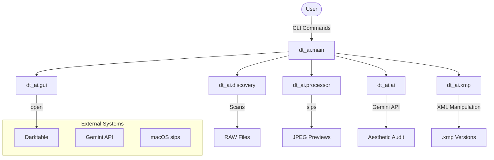

# Architecture - Darktable GenAI Assistant

## Overview
The system follows a modular pipeline architecture, primarily driven by a CLI interface. It bridges the gap between RAW image data, AI vision analysis, and Darktable's non-destructive editing engine.

## Architectural Map

## Design Patterns

### 1. Command Pattern (CLI)
The `click` framework is used to implement the Command pattern. Each CLI command (`init-session`, `audit`, `edit`) encapsulated a specific workflow and handles user interaction.

### 2. Pipeline Pattern
The `run_pipeline` function in `main.py` implements a sequential processing pipeline:
1.  **Discovery:** Locate targets.
2.  **Extraction:** Prepare visual data for AI.
3.  **Analysis:** Obtain AI reasoning.
4.  **Reporting:** Persist AI findings.
5.  **Injection:** Transform AI findings into XMP modules.
6.  **Handoff:** (Optional) Transition to interactive editing.

### 3. Non-Destructive Layering
The system treats the original RAW file as immutable. All state and edits are stored in `.xmp` sidecar files. Darktable's versioning system is leveraged by creating numbered sidecars (e.g., `image_01.arw.xmp`) to allow for multiple AI-suggested variations.

### 4. Hex Encoding Utility
The `xmp.py` module contains a specialized utility for encoding floating-point parameters into Darktable's internal hex format (IEEE 754 little-endian), acting as a bridge between high-level AI recommendations and low-level application state.

## Integration Points
- **Gemini CLI:** Used as the primary intelligence engine.
- **sips:** Used for high-speed, native JPEG extraction from RAW.
- **Darktable:** The target application for the generated metadata.
