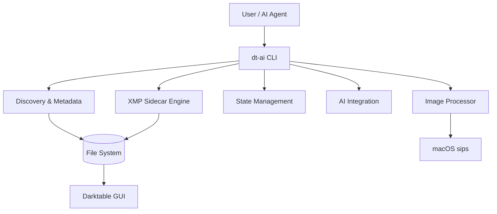

# Architecture

## System Architecture

The dt-ai system is designed as a CLI-first application that acts as an intermediary between the user's filesystem (RAW photos), an AI Assistant (Gemini), and Darktable.

## Architectural Principles

1. **Non-Destructive Operations**: The system NEVER modifies the original RAW files. All edits and variations are written to Darktable-compatible `.xmp` sidecar files.
2. **Stateless Operations with Persistent Sessions**: The CLI commands are mostly stateless but utilize a hidden `.dt-ai-state.json` file in the working directory to track session progress.
3. **Hardware & Pipeline Awareness**: The architecture enforces modern scene-referred workflows (AgX, sigmoid) and applies hardware-specific sensor corrections automatically.