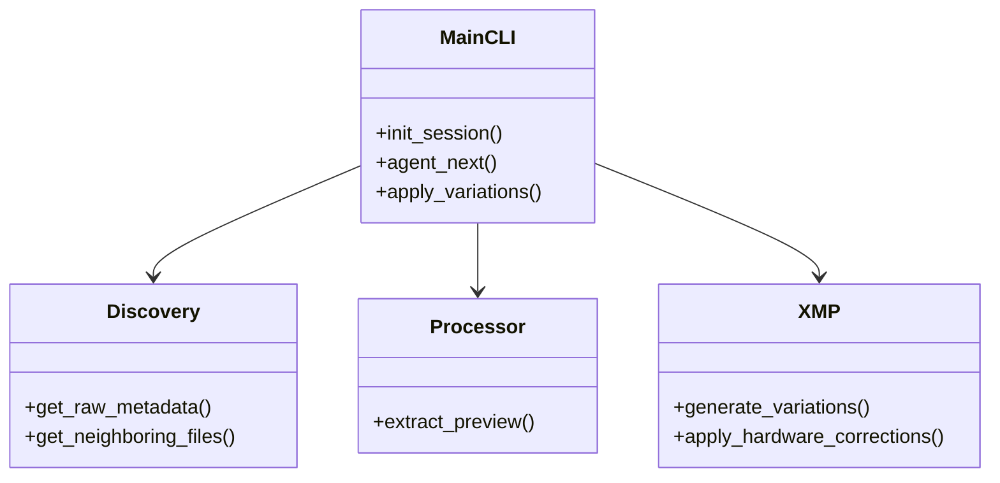

# Components

## Core Modules (`dt_ai/`)

| Component | File | Description |
|-----------|------|-------------|
| **CLI Orchestrator** | `main.py` | Defines the Click CLI commands (`init-session`, `agent-next`, `apply-variations`, `audit`, `edit`). Orchestrates the flow between other components. |
| **AI Integration** | `ai.py` | Manages AI prompts, specifically the `AESTHETIC_PROMPT`, and handles parsing and synthesizing the structured JSON responses from the AI. |
| **Discovery Engine** | `discovery.py` | Scans directories for RAW files, identifies neighboring files for context, and extracts EXIF metadata (camera model, lens, ISO, etc.). |
| **Image Processor** | `processor.py` | Interfaces with macOS `sips` to rapidly extract small, high-quality JPEG previews from RAW files without needing to decode the full RAW data. |
| **Sidecar Engine** | `xmp.py` | Handles the generation and modification of Darktable `.xmp` XML files. Responsible for translating high-level parameter intents into IEEE 754 hex-encoded strings required by Darktable. |
| **State Manager** | `state.py` | Manages the `.dt-ai-state.json` file to track which images have been processed and what styles were applied. |
| **GUI Integration** | `gui.py` | Utilities for handing off the session or specific files to the Darktable application. |
| **Research Database** | `research.py` | Provides domain-specific tips and best practices (e.g., Wildlife, Landscape, Macro) to inform the AI's aesthetic choices. |

## Component Relationships

