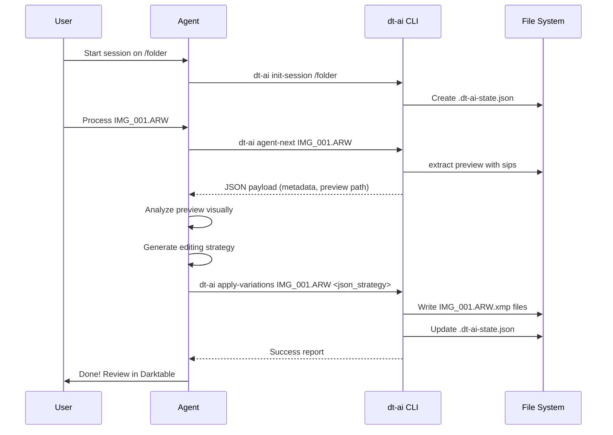

# Workflows

## Standard AI Agent Workflow

This workflow represents how an external AI agent interacts with the `dt-ai` tools.

## Variation Generation Pipeline

1. **Pre-flight Report**: `main.py` formats the AI's intent into a readable summary.
2. **Hardware Corrections**: `xmp.py` checks metadata (e.g. camera model) and applies necessary offsets (like black-point fixes).
3. **AgX Enforcement**: Darktable legacy tone mappers are disabled, and modern scene-referred modules are enabled.
4. **Encoding**: Target parameters (exposure, kelvin) are converted to IEEE 754 little-endian hex strings.
5. **XML Writing**: Duplicate `.xmp` files are written to disk.