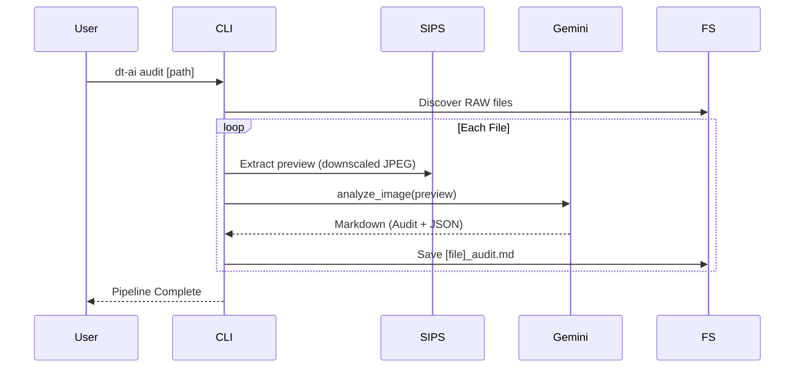
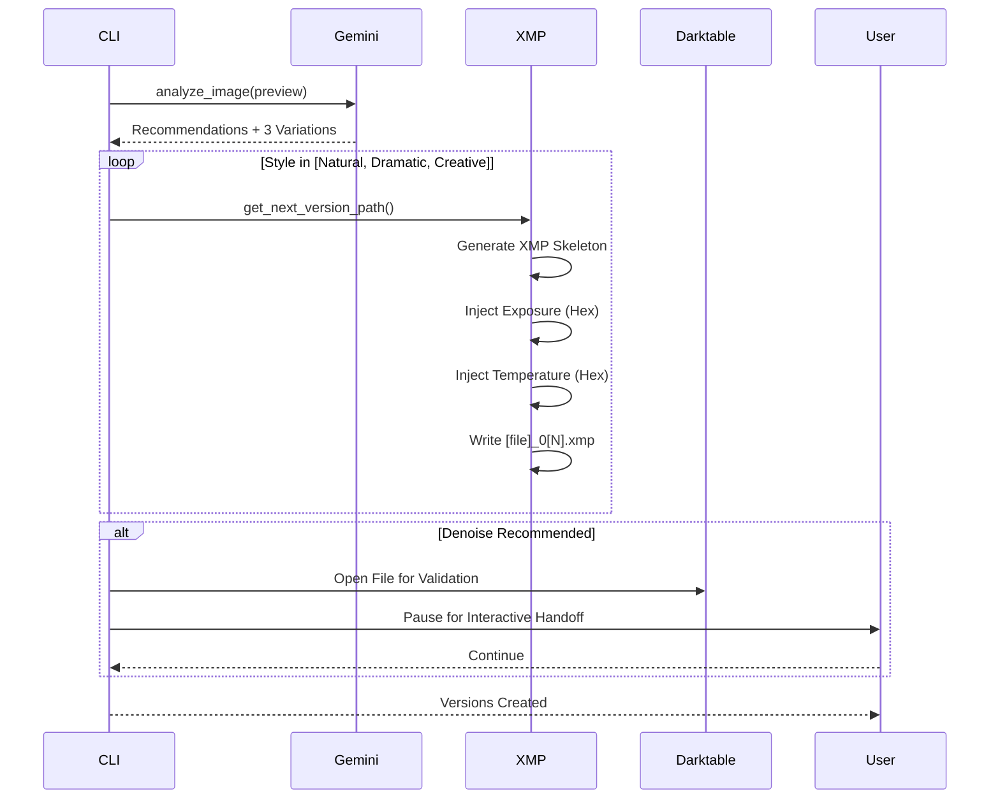

# Workflows - Darktable GenAI Assistant

## 1. Aesthetic Audit Workflow (`dt-ai audit`)
This workflow focuses on technical and aesthetic evaluation without modifying image state.

## 2. GenAI Edit Workflow (`dt-ai edit`)
This workflow extends the audit by generating three distinct processing variations.

## 3. Interactive Handoff (Denoise Safety)
Because AI-driven denoising is risky and hardware-dependent, the system includes a "Take a Call" safety check:
1.  **Detection:** `main.py` checks recommendations for "denoise".
2.  **Automation:** Launches Darktable using `gui.py`.
3.  **Interaction:** Prompts the user to validate settings before moving to the next image in a batch.
