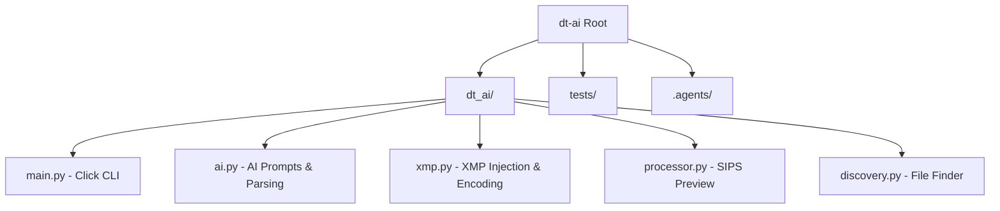

# AGENTS.md - Darktable GenAI Assistant (dt-ai)

This file provides a starting point for AI assistants to navigate the `dt-ai` codebase. For detailed documentation, see [.agents/summary/index.md](.agents/summary/index.md).

## Directory Overview & Component Map

### Major Subsystems
- **CLI Orchestration (`main.py`)**: Defines Click commands like `agent-next` and `apply-variations`.
- **Sidecar Engine (`xmp.py`)**: Crucial for Darktable integration. Handles XML generation, AgX enforcement, and IEEE 754 hex encoding.
- **Preview Extraction (`processor.py`)**: Uses macOS native `sips` for extremely fast thumbnail generation.

## Repo-Specific Tools & Patterns
- **`uv`**: We use `uv` for fast dependency management. Tests are run via `uv run pytest`.
- **macOS `sips`**: Be aware that the preview generation is currently hardcoded to macOS.
- **Non-Destructive XMP Generation**: The system never edits RAWs. It duplicates existing sidecars and increments their version number.
- **JSON-based Agent Handoff**: `dt-ai agent-next` outputs a strict JSON payload that AI wrappers must parse.

## Custom Instructions

<!-- This section is maintained by developers and agents during day-to-day work.
     It is NOT auto-generated by codebase-summary and MUST be preserved during refreshes.
     Add project-specific conventions, gotchas, and workflow requirements here. -->